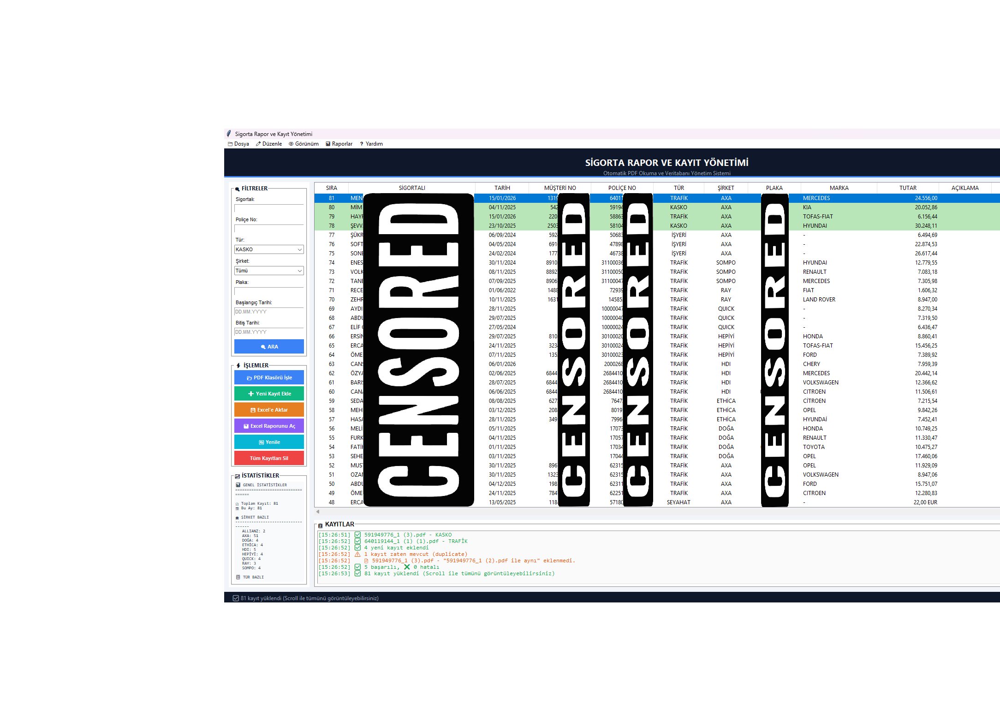
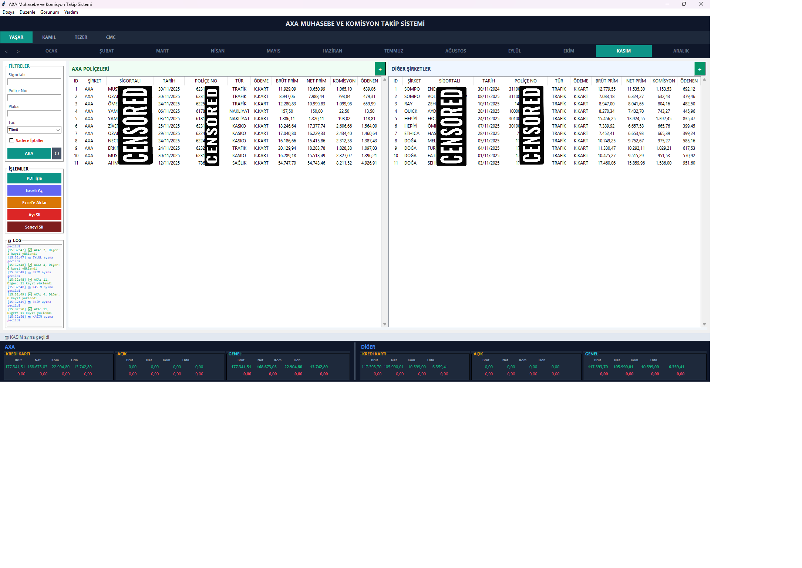

# Sigorta Yönetim Sistemi

**Sigorta acentelerine özel, PDF poliçe okuma ve muhasebe takip yazılımı.**

Python · Tkinter · SQLite · pdfplumber

---

## İki Bağımsız Uygulama

| | Rapor | Muhasebe |
|---|---|---|
| **Amaç** | Poliçeleri kayıt altına al | Komisyon hesapla ve takip et |
| **Girdi** | PDF poliçe klasörü | PDF poliçe klasörü |
| **Çıktı** | SQLite veritabanı + Excel | SQLite veritabanı + Excel raporu |
| **Çalıştır** | `cd rapor && python main.py` | `cd muhasebe && python main.py` |

---

## Rapor Uygulaması

Klasördeki PDF poliçeleri toplu okur, her poliçeden sigortalı adı, tarih, poliçe numarası, tutar gibi bilgileri çıkarır ve veritabanına kaydeder.



### Çalışma Mantığı

```
┌─────────────────────────────────────────────────────────────────┐
│                        RAPOR UYGULAMASI                         │
└─────────────────────────────────────────────────────────────────┘

  Kullanıcı bir PDF klasörü seçer
           │
           ▼
  ┌─────────────────┐
  │  Her PDF için:  │
  └────────┬────────┘
           │
           ▼
  ┌──────────────────────────────────────────────────────────────┐
  │  ADIM 1 – Şirket & Tür Tespiti (parser.py)                  │
  │                                                              │
  │  PDF metni okunur → İçerikte anahtar kelimeler aranır        │
  │                                                              │
  │  "HDI SİGORTA" → TRAFİK_HDI                                 │
  │  "ALLIANZ"     → TRAFİK_ALLIANZ veya KASKO_ALLIANZ          │
  │  "ZORUNLU DEPREM" → DASK                                     │
  │  "SEYAHAT SİGORTASI" → SEYAHAT                              │
  │  ... (10+ şirket, 8+ poliçe türü)                           │
  └──────────────────────────┬───────────────────────────────────┘
                             │
                             ▼
  ┌──────────────────────────────────────────────────────────────┐
  │  ADIM 2 – Veri Çıkarma (Regex)                               │
  │                                                              │
  │  Her şirketin PDF formatına özel regex pattern'ları çalışır  │
  │                                                              │
  │  Çıkarılan alanlar:                                          │
  │  ├── SİGORTALI ADI       (regex: "Adı Soyadı: ...")          │
  │  ├── TARİH               (regex: "Başlangıç Tarihi: ...")     │
  │  ├── POLİÇE NO           (regex: "\d{10,}")                  │
  │  ├── PLAKA               (regex: "\d{2}[A-Z]{1,4}\d{2,5}")   │
  │  ├── MARKA               (regex: "Marka: ...")               │
  │  └── TUTAR               (regex: "Ödenecek Prim: ...")        │
  └──────────────────────────┬───────────────────────────────────┘
                             │
                             ▼
  ┌──────────────────────────────────────────────────────────────┐
  │  ADIM 3 – Duplicate Kontrolü & Kayıt (database.py)           │
  │                                                              │
  │  police_no zaten DB'de var mı?                               │
  │       EVET → Atla (log'a yaz)                                │
  │       HAYIR → SQLite'a ekle (UNIQUE constraint)              │
  └──────────────────────────┬───────────────────────────────────┘
                             │
                             ▼
  ┌──────────────────────────────────────────────────────────────┐
  │  ADIM 4 – Arayüz (gui.py)                                    │
  │                                                              │
  │  Yeni eklenen kayıtlar yeşil renkte gösterilir               │
  │  Filtrele → Sigortalı / Tarih / Tür / Şirket / Plaka        │
  │  Düzenle  → Hücreye çift tıkla, değiştir, Enter             │
  │  Dışa aktar → Excel (.xlsx)                                  │
  └──────────────────────────────────────────────────────────────┘
```

### Özellikler

- **Toplu işlem** — Bir klasördeki tüm PDF'leri tek seferde tarar
- **Otomatik şirket tespiti** — "Eski sigorta şirketi" gibi yanıltıcı satırları temizleyerek doğru şirketi bulur
- **Duplicate koruması** — Aynı poliçe numarasına sahip kayıt bir daha eklenmez
- **Eksik bilgi işareti** — Sigortalı adı veya poliçe no okunamazsa kayıt `[EKSİK]` etiketiyle yine de eklenir
- **Satır içi düzenleme** — Tablodaki herhangi bir hücreye çift tıklayarak doğrudan düzenlenebilir
- **İstatistik paneli** — Şirket ve tür bazlı anlık dağılım

### Desteklenen Şirket & Tür Matrisi

| Şirket | Trafik | Kasko | Seyahat | Sağlık | DASK | İşyeri | Nakliyat | Konut |
|--------|:------:|:-----:|:-------:|:------:|:----:|:------:|:--------:|:-----:|
|  AXA | ✅ | ✅ | ✅ | ✅ | ✅ | ✅ | ✅ | ✅ |
|  HDI | ✅ | — | — | — | — | — | — | — |
|  Allianz | ✅ | ✅ | — | — | — | — | — | — |
|  ETHİCA | ✅ | — | — | — | — | — | — | — |
|  SOMPO | ✅ | — | — | — | — | — | — | — |
|  RAY | ✅ | — | — | — | — | — | — | — |
|  QUICK | ✅ | — | — | — | — | — | — | — |
|  DOĞA | ✅ | — | — | — | — | — | — | — |
|  HEPİYİ | ✅ | — | — | — | — | — | — | — |

---

## Muhasebe Uygulaması

Sigorta acentesinin her kişi adına yaptığı poliçelerden komisyon tutarını otomatik hesaplar; aylık, yıllık Excel raporları üretir.



### Çalışma Mantığı

```
┌─────────────────────────────────────────────────────────────────┐
│                      MUHASEBE UYGULAMASI                        │
└─────────────────────────────────────────────────────────────────┘

  Sekmeler: [ YAŞAR ] [ KAMİL ] [ TEZER ] [ CMC ]
  Ay seçimi: [ OCAK ] [ ŞUBAT ] ... [ ARALIK ]
           │
           ▼
  ┌──────────────────────────────────────────────────────────────┐
  │  ADIM 1 – PDF Okuma (parsers/)                               │
  │                                                              │
  │  AXA poliçesi?  → axa_parser.py                             │
  │  Diğer şirket?  → multi_parser.py                           │
  │                                                              │
  │  Her PDF'den çıkarılır:                                      │
  │  ├── Sigortalı adı                                           │
  │  ├── Poliçe no                                               │
  │  ├── Brüt prim                                               │
  │  ├── Tramer tutarı                                           │
  │  └── Net prim = Brüt - Tramer                               │
  └──────────────────────────┬───────────────────────────────────┘
                             │
                             ▼
  ┌──────────────────────────────────────────────────────────────┐
  │  ADIM 2 – Komisyon Hesaplama (commission.py)                 │
  │                                                              │
  │  Komisyon Oranı:                                             │
  │  ┌──────────────────────────────────────┐                   │
  │  │ Poliçe Türü      │ Oran              │                   │
  │  ├──────────────────┼───────────────────┤                   │
  │  │ Trafik           │ %10 (herkes)      │                   │
  │  │ DASK             │ Net Prim ÷ 7.25   │                   │
  │  │ Diğer (Tezer)    │ %13               │                   │
  │  │ Diğer (Diğerleri)│ %15               │                   │
  │  └──────────────────┴───────────────────┘                   │
  │                                                              │
  │  Ödeme Oranı:                                                │
  │  ┌──────────────────────────────────────┐                   │
  │  │ Kişi             │ Ödenen Pay        │                   │
  │  ├──────────────────┼───────────────────┤                   │
  │  │ YAŞAR            │ Komisyonun %60'ı  │                   │
  │  │ KAMİL / TEZER /  │ Komisyonun %50'si │                   │
  │  │ CMC              │                   │                   │
  │  └──────────────────┴───────────────────┘                   │
  └──────────────────────────┬───────────────────────────────────┘
                             │
                             ▼
  ┌──────────────────────────────────────────────────────────────┐
  │  ADIM 3 – Veritabanı Kaydı (database.py)                     │
  │                                                              │
  │  AXA poliçeleri  → komisyonlar_axa tablosu                  │
  │  Diğer şirketler → komisyonlar_other tablosu                 │
  │                                                              │
  │  Her kayıtta: brüt_prim, tramer, net_prim,                  │
  │  komisyon_orani, toplam_komisyon, odeme_orani,               │
  │  odenen_komisyon, ikinci_police (bool), iptal (bool)         │
  └──────────────────────────┬───────────────────────────────────┘
                             │
                             ▼
  ┌──────────────────────────────────────────────────────────────┐
  │  ADIM 4 – Excel Raporu (gui.py → export_to_excel)            │
  │                                                              │
  │  Kişi başına ayrı sekme                                      │
  │  ├── AXA tablosu (brüt, tramer, net, komisyon, ödenen)      │
  │  ├── Diğer şirketler tablosu                                 │
  │  ├── Aylık özet satırları                                    │
  │  └── Renk kodlaması:                                         │
  │       🟡 Sarı  → İkinci poliçe (sadece çekim)               │
  │       🔴 Kırmızı → İptal poliçe                              │
  │       🟢 Yeşil → Açık ödeme                                  │
  └──────────────────────────────────────────────────────────────┘
```

### Özellikler

- **Kişi + Ay bazlı görünüm** — Her sekme ayrı kişiyi, ay butonları belirli ayı gösterir
- **İkinci poliçe mantığı** — Aynı işin ikinci poliçesinde komisyon hesaplanmaz, sadece çekim yapılır (sarı uyarı)
- **İptal poliçe yönetimi** — İptal edilen poliçeler kırmızı renkte gösterilir, negatif tutarla özete yansır
- **Cari takip** — POS tahsilat makbuzlarını (PDF) okur, ay bazlı cari listesi oluşturur
- **Excel import** — Eski Excel tablolarından veri aktarımı (renkli hücre okuma dahil)
- **Ödeme türü** — K.Kart / Açık ayrımı; açık ödemelerde toplam takibi

---

## Kurulum

```bash
git clone https://github.com/EmreVarank/Sigorta-Yonetim-Sistemi.git
cd Sigorta-Yonetim-Sistemi
pip install -r requirements.txt
```

**Gereksinimler:** Python 3.9+ · pdfplumber · PyPDF2 · pandas · openpyxl

---

## Kullanım

```bash
# Rapor uygulaması
cd rapor
python main.py

# Muhasebe uygulaması
cd muhasebe
python main.py
```

---

## Proje Yapısı

```
sigorta-yonetim-sistemi/
├── rapor/
│   ├── main.py          ← giriş noktası
│   ├── parser.py        ← PDF okuma motoru (10+ şirket, 1400+ satır regex)
│   ├── database.py      ← SQLite yönetimi (rapor_veritabani.db)
│   └── gui.py           ← Tkinter arayüzü
│
├── muhasebe/
│   ├── main.py          ← giriş noktası
│   ├── commission.py    ← komisyon kuralları ve yardımcı fonksiyonlar
│   ├── database.py      ← SQLite yönetimi (komisyon_veritabani.db)
│   ├── gui.py           ← Tkinter arayüzü
│   └── parsers/
│       ├── multi_parser.py  ← çok şirketli PDF parser
│       └── axa_parser.py    ← AXA özel parser
│
├── requirements.txt
└── LICENSE
```

---

## EXE Olarak Derleme (PyInstaller)

```bash
pip install pyinstaller

# Rapor uygulaması
cd rapor
pyinstaller --onefile --windowed --name="SigortaRapor" main.py

# Muhasebe uygulaması
cd muhasebe
pyinstaller --onefile --windowed --name="SigortaMuhasebe" main.py
```

Derlenen `.exe` dosyası çalıştırıldığı klasörde otomatik olarak veritabanı oluşturur.

---

## Lisans

MIT License
